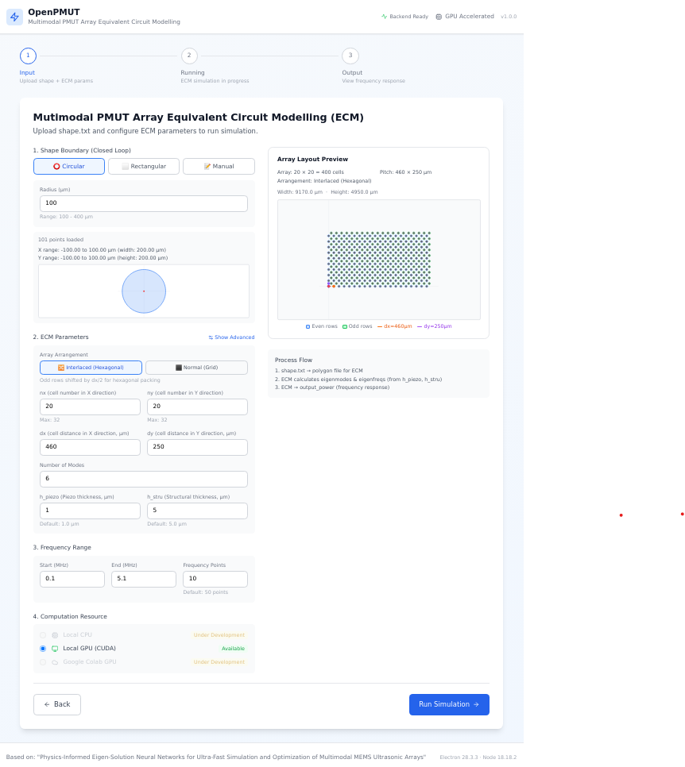
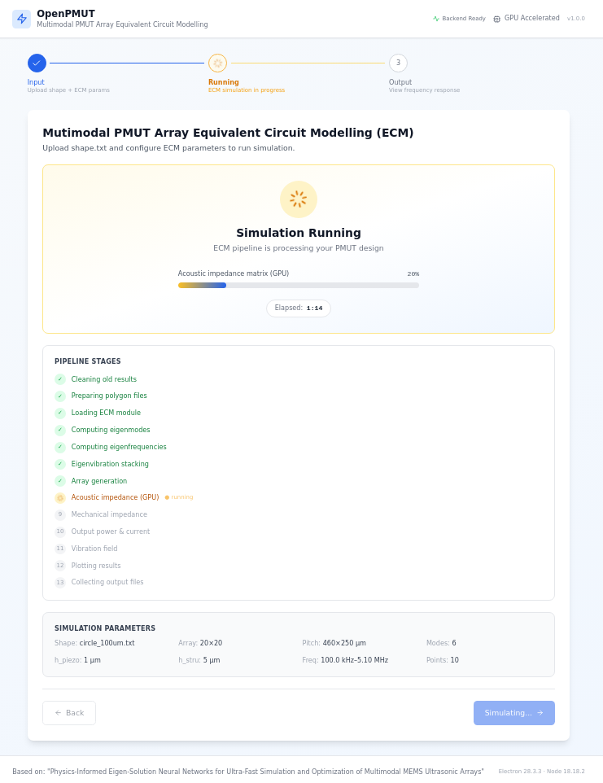
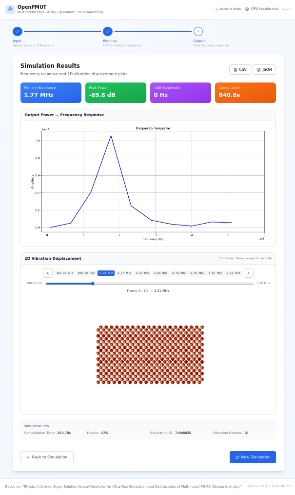

# OpenPMUT Desktop V1.0.0

A standalone desktop application for PMUT (Piezoelectric Micromachined Ultrasonic Transducer) array simulation using Equivalent Circuit Modelling (ECM) with GPU acceleration.

---

## Application Screenshots

### Step 1 — Define Parameters
Configure the PMUT array geometry, material properties, and simulation parameters.



### Step 2 — Run Simulation
Execute the ECM simulation pipeline with GPU acceleration and monitor progress in real time.



### Step 3 — View Output Results
Visualize simulation results including frequency response, vibration modes, and acoustic output.



---

## Quick Start

To conduct similar studies, start by cloning this repository via:

```bash
git clone https://github.com/Jasper123y/OpenPMUT.git
cd OpenPMUT
./openpmut
```

That's it! On **first run**, `./openpmut` will guide you through setting up a Python environment:
- If you already have conda activated with the right packages → it just works
- If you have conda but no suitable env → it offers to create one (`openpmut`)
- If conda is not loaded → it detects Environment Modules (`module load`) or common paths
- If you don't have conda at all → it offers to install Miniconda for you

After the first run, `./openpmut` remembers your Python path (saved inside the installation folder as `.python_path`).
On subsequent runs it shows the saved environment and asks you to confirm — press Enter to reuse it instantly.
Closing the window kills the backend and exits cleanly — just run `./openpmut` again to relaunch.

---

## Requirements

| Requirement | Details |
|---|---|
| **Linux x86_64** | Tested on CentOS/RHEL/Ubuntu |
| **NVIDIA GPU + CUDA** | Required for simulation |
| **X11 display** | `echo $DISPLAY` should show `:0` or similar |

**No Node.js/npm required** — the Electron runtime is bundled in the package.
Python and conda will be set up automatically by `./openpmut` if not already available.

---

## Usage

```bash
# Standard launch
./openpmut

# Specify Python explicitly (skip auto-detection)
./openpmut --python /path/to/python

# Custom port (if 18765 is taken)
./openpmut --port 19000

# Re-select conda/Python environment
./openpmut --reset

# Show version
./openpmut --version

# Stop all OpenPMUT processes
./stop.sh

# Help
./openpmut --help
```

---

## What's Inside the Zip

```
OpenPMUT-Desktop/
├── openpmut               # ← Main launcher script (V1.0.0)
├── stop.sh                # Stop all processes
├── README.md              # This file
├── package.json           # Node.js package metadata
├── dist-electron/         # Compiled Electron main process (JS)
│   ├── main.js            #   Electron entry point
│   └── preload.js         #   IPC bridge
├── dist-renderer/         # Built React frontend (HTML/JS/CSS)
│   ├── index.html
│   └── assets/
├── python-backend/        # FastAPI backend + simulation engine
│   ├── app/               #   FastAPI routes, services, schemas
│   ├── ECM/               #   ECM simulation pipeline (a02–a11)
│   ├── eigenmode_solver/  #   Eigenmode analysis
│   ├── eigenprediction/   #   PINN-based prediction + model weights
│   ├── models/            #   Pre-trained model files
│   ├── examples/          #   Example shape files
│   └── output/            #   Simulation output directory
├── assets/icons/          # App icon (SVG)
└── node_modules/electron/ # Bundled Electron runtime (~130MB)
```

---

## Building the Zip (For Developers)

### Prerequisites

Build must be done from the **source tree** (not from an extracted zip):

```
/path/to/pmut_user_platform/OpenPMUT-Desktop/   # source directory
```

You need Node.js (≥18) and npm installed for building.

### Step 1 — Install dependencies and build

```bash
cd /path/to/OpenPMUT-Desktop

# Install Node.js dependencies (only needed once)
npm install --legacy-peer-deps

# Build the frontend (React → dist-renderer/)
npm run build

# Build the Electron main process (TypeScript → dist-electron/)
npx tsc -p tsconfig.electron.json
```

### Step 2 — Create the zip

From the **parent directory** of `OpenPMUT-Desktop/`:

```bash
cd /path/to/parent-of-OpenPMUT-Desktop/

zip -r OpenPMUT-Desktop.zip OpenPMUT-Desktop/ \
  -x "OpenPMUT-Desktop/node_modules/*" \
     "OpenPMUT-Desktop/src/*" \
     "OpenPMUT-Desktop/electron/*" \
     "OpenPMUT-Desktop/tsconfig*" \
     "OpenPMUT-Desktop/postcss*" \
     "OpenPMUT-Desktop/tailwind*" \
     "OpenPMUT-Desktop/vite*" \
     "OpenPMUT-Desktop/index.html" \
     "OpenPMUT-Desktop/dev.sh" \
     "OpenPMUT-Desktop/build.sh" \
     "OpenPMUT-Desktop/.gitignore" \
     "OpenPMUT-Desktop/.python_path" \
  --symlinks

# Then add ONLY the electron runtime back (from node_modules)
zip -r OpenPMUT-Desktop.zip OpenPMUT-Desktop/node_modules/electron/ --symlinks
```

### What's INCLUDED in the zip

| Path | Why |
|---|---|
| `openpmut` | Main launcher script |
| `stop.sh` | Process cleanup script |
| `README.md` | Documentation |
| `package.json` | App metadata (version, name) |
| `dist-electron/` | Compiled Electron JS (main.js, preload.js) |
| `dist-renderer/` | Built React frontend (index.html, assets/) |
| `python-backend/` | Full backend: FastAPI app, ECM, eigenmode_solver, eigenprediction, models, examples, output |
| `assets/` | App icons |
| `node_modules/electron/` | **Only** the Electron runtime binary (~130MB) |

### What's EXCLUDED from the zip

| Path | Why |
|---|---|
| `node_modules/*` (except `electron/`) | Not needed at runtime — only Electron binary is required |
| `src/` | React/TypeScript source — already compiled to `dist-renderer/` |
| `electron/` | Electron TypeScript source — already compiled to `dist-electron/` |
| `tsconfig*.json` | TypeScript config — build-time only |
| `postcss.config.js` | PostCSS config — build-time only |
| `tailwind.config.js` | Tailwind CSS config — build-time only |
| `vite.config.ts` | Vite bundler config — build-time only |
| `index.html` | Vite entry point — `dist-renderer/index.html` is used instead |
| `dev.sh`, `build.sh` | Developer scripts — not needed by users |
| `.gitignore` | Git config |
| `.python_path` | Per-installation saved Python path — must NOT ship in zip (created on first run) |

### Expected zip size

~138MB (mostly the bundled Electron binary).

### Verifying the zip

```bash
# Extract to a test directory
mkdir /tmp/test-openpmut && cd /tmp/test-openpmut
unzip OpenPMUT-Desktop.zip

# Set permissions
chmod +x OpenPMUT-Desktop/openpmut
chmod +x OpenPMUT-Desktop/stop.sh
chmod +x OpenPMUT-Desktop/node_modules/electron/dist/electron

# Verify syntax
bash -n OpenPMUT-Desktop/openpmut

# Verify no .python_path shipped
ls OpenPMUT-Desktop/.python_path 2>/dev/null && echo "ERROR: .python_path should not be in zip" || echo "OK"

# Launch
cd OpenPMUT-Desktop
./openpmut
```

---

## Troubleshooting

| Problem | Solution |
|---|---|
| App doesn't start | Check `~/.openpmut/launch.log` |
| "Missing packages" | `./openpmut` will offer to create a new env for you |
| No display / blank | Need X11: use `ssh -X` or set `DISPLAY` |
| Port already in use | `./openpmut --port 19000` or `./stop.sh` first |
| GPU not detected | Install CuPy: `pip install cupy-cuda12x` (CPU still works) |
| Want to re-select env | `./openpmut --reset` |
| Window close didn't kill backend | Run `./stop.sh` to clean up |

Logs: `~/.openpmut/launch.log`
